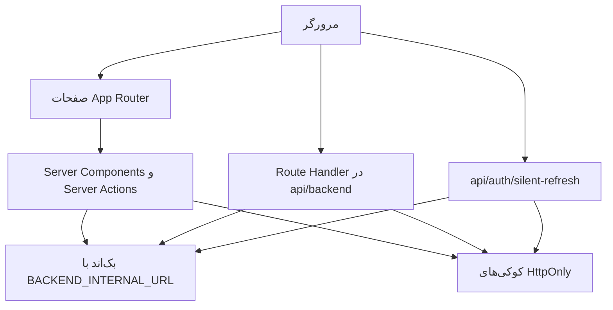

# معماری پروژه

## پشته و تنظیمات

نسخه‌های زیر از `package.json` خوانده شده‌اند؛ بازه‌هایی که با `^` مشخص شده‌اند الزاماً نسخه دقیق نصب‌شده نیستند.

| جزء | نسخه/وضعیت در پروژه |
| --- | --- |
| Next.js | `16.2.12`، App Router و پوشه `src/app` |
| React / React DOM | `19.2.4` |
| TypeScript | `^5`، `strict: true` و `noEmit: true` |
| Tailwind CSS | `^4` و افزونه PostCSS |
| فرم و اعتبارسنجی | React Hook Form `^7.83.0`، Zod `^4.4.3`، resolvers |
| رابط کاربری | اجزای محلی `components/ui`، Base UI، Radix، Lucide و Sonner |
| نشست | `jose ^6.2.4`، JWT و کوکی HttpOnly |
| نقشه | Leaflet `^1.9.4` و React Leaflet `^5.0.0` |

بسته‌هایی مثل React Query، React Table، Zustand، next-intl، Recharts و Tiptap در dependencies ثبت شده‌اند؛ نصب آن‌ها به‌تنهایی نشان نمی‌دهد جریان اصلی برنامه از آن‌ها استفاده می‌کند. فرم‌ها و onboarding فعلی عمدتاً با state محلی، Context و Server Actions کار می‌کنند.

## ساختار مسئولیت‌ها

| مسیر | مسئولیت |
| --- | --- |
| `src/app` | صفحات، layoutها، loading و Route Handlerها |
| `src/features/home` | بخش‌های صفحه خانه و ناوبری آن |
| `src/features/public` | فهرست و پروفایل عمومی، نقشه، نظرات و علاقه‌مندی |
| `src/features/auth` | درخواست/تأیید OTP، فرم ورود و خروج |
| `src/features/profile` | تکمیل و ویرایش حساب کاربری |
| `src/features/dashboard` | سربرگ، کارت کاربر و آیتم‌های داشبورد |
| `src/features/business` | ثبت، مدارک، پروفایل، مراحل و داده‌های کسب‌وکار |
| `src/features/admin` | فرم‌ها، عملیات و مدل‌های پنل مدیر |
| `src/features/notifications` | مدل اعلان، نمایش و خوانده‌شدن |
| `src/components/ui` | اجزای قابل استفاده مجدد مانند input، button و sheet |
| `src/lib` | احراز هویت، API، اعتبارسنجی، تاریخ شمسی و ثابت‌ها |
| `src/types/auth.ts` | شکل داده کاربر و پاسخ ورود |
| `src/proxy.ts` | محافظت اولیه صفحات و تشخیص نقش مدیر |
| `tests` | تست‌های Node برای ترتیب مراحل، دسته‌بندی و payload ثبت |
| `public` | فایل‌های ایستا؛ فعلاً عمدتاً SVGهای اولیه |

جزئیات تمام فایل‌ها در [فهرست سورس](SOURCE-MAP.md) آمده است. alias `@/*` به `src/*` اشاره می‌کند. Route Groupهایی مثل `(public)` و `(dashboard)` در URL دیده نمی‌شوند.

## جریان داده

Server Components برای دریافت داده و ساخت صفحه استفاده می‌شوند. اجزای دارای `use client` فرم، تعامل، نقشه و state مرورگر را مدیریت می‌کنند. Server Actions با `use server` توکن را از کوکی خوانده و مستقیماً به بک‌اند درخواست می‌زنند. درخواست‌های مستقیم مرورگر مانند پیشرفت onboarding از پراکسی هم‌مبدأ استفاده می‌کنند. جزئیات refresh برای این دو مسیر یکسان نیست؛ [API و احراز هویت](API-AUTH.md) را ببینید.

اغلب fetchها `cache: "no-store"` دارند. پس از mutation، بسیاری از actionها از `revalidatePath` و اجزای کلاینت از `router.refresh()` استفاده می‌کنند. دریافت‌های صفحات از `pageFetch`/`backendGet` با timeout استفاده می‌کنند؛ خطای سرویس به error boundary ریشه می‌رسد و ۴۰۴ واقعی جداست. داده اختیاری اقساط می‌تواند با ۲۰۴/۴۰۴ خالی باشد. دریافت کاربر در خانه همچنان در نبود نشست/خطای سرویس به حالت ناشناس برمی‌گردد.

## UI، فارسی و نقشه

Root layout زبان `fa` و جهت `rtl` دارد؛ Sonner در بالای صفحه پیام نمایش می‌دهد. Tailwind و CSS عمومی ظاهر مشترک را تعریف می‌کنند. فونت سیستمی Tahoma/Arial و monospace استفاده می‌شود. دریافت فونت Google از build حذف و متغیر CSS خودارجاع فونت اصلاح شده است.

نقشه از tileهای OpenStreetMap استفاده می‌کند. انتخاب موقعیت و نمایش نقشه در اجزای کلاینت انجام می‌شود؛ برای افزودن نقشه جدید، الگوی dynamic import موجود و محدودیت SSR در Leaflet را رعایت کنید. تاریخ شمسی در `src/lib/utils/jalali.ts` تبدیل می‌شود و داده تاریخ برای API به شکل میلادی آماده می‌شود.

## مرز بک‌اند و دیتابیس

در این فرانت‌اند مدل دیتابیس، migration یا schema تولیدشده OpenAPI وجود ندارد. interfaceهای TypeScript، انتظارات فرانت از پاسخ هستند و اعتبارسنجی زمان اجرا یا اثبات قرارداد بک‌اند محسوب نمی‌شوند. مالکیت کسب‌وکار، مجوز فایل، نقش‌ها، Tenant، rate limit و صحت نهایی ورودی باید در بک‌اند نیز اعمال شود.
