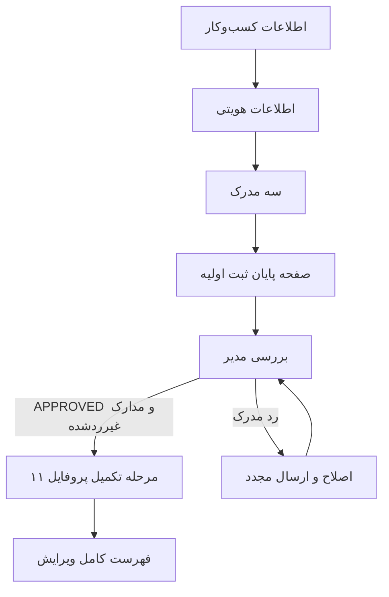

# ثبت و تکمیل کسب‌وکار

## چهار وضعیت مستقل

ثبت اولیه، ثبت مدارک، تأیید مدیر و تکمیل پروفایل چهار مفهوم جدا هستند. پایان wizard به معنی `APPROVED` نیست و `onboardingStep=11` نیز به‌تنهایی اثبات تأیید یا کامل‌بودن تمام اطلاعات اختیاری نیست.

منابع اصلی: `business-wizard.tsx`، `registration.ts`، layout پروفایل، `onboarding-steps.ts` و `onboarding-context.tsx` در feature کسب‌وکار.

## ثبت اولیه و ادامه کار

صفحه `/dashboard/business/new` کاربر، دسته‌ها، اولین کسب‌وکار متعلق به کاربر و مدارک آن را دریافت می‌کند. wizard چهار نمای `business-info`، `identity`، `documents` و `success` دارد. اگر کسب‌وکار و همه مدارک غیرردشده موجود باشند، از نمای success شروع می‌کند؛ در غیر این صورت داده کسب‌وکار موجود برای ادامه/ویرایش به فرم‌ها داده می‌شود.

فرم کسب‌وکار نام حداقل دو حرف، شماره حداقل هشت کاراکتر، بیوگرافی حداکثر صد کاراکتر، دسته، استان و شهر دارد. create action دسته انتخابی را به `categoryIds: [categoryId]` تبدیل می‌کند، آدرس را از استان و شهر می‌سازد و `businessType: "SOLE_PROPRIETOR"` ارسال می‌کند. در ادامه ثبت موجود، `existingBusinessId` به فرم داده می‌شود تا ویرایش جای ایجاد تکراری را بگیرد.

اطلاعات هویتی شامل نام شرکت، شماره پروانه، کد صنفی، تاریخ صدور، نام فرد، نام پدر، کد ملی، تولد و ایمیل است. metadata مجوز همراه مدرک پروانه ثبت می‌شود؛ اطلاعات فرد در حساب کاربر ذخیره می‌شود. بازگشت در wizard state فعلی را نگه می‌دارد، اما ورودی ذخیره‌نشده تضمین ماندگاری پس از refresh ندارد. داده‌های ذخیره‌شده از API دوباره خوانده می‌شوند.

## مدارک

| نوع API | معنا |
| --- | --- |
| `NATIONAL_ID_FRONT` | روی کارت ملی |
| `NATIONAL_ID_BACK` | پشت کارت ملی |
| `BUSINESS_LICENSE_PHOTO` | تصویر پروانه کسب و metadata مربوط |

فایل با FormData و نام فیلد `file` آپلود می‌شود. پاسخ upload باید `id` داشته باشد؛ این مقدار به عنوان `fileId` با نوع مدرک ارسال می‌شود. `acceptedDocuments` هر وضعیت غیر `REJECTED` را برای تکمیل ثبت می‌پذیرد، حتی `PENDING`؛ نام تابع به معنی تأیید مدیریتی نیست. وضعیت اول از `verificationStatus` و در نبود آن از `status` خوانده می‌شود.

داشبورد و layout پروفایل اکنون هر دو از registrationIncomplete استفاده می‌کنند و مدارک ردشده را ناکافی می‌دانند. مسیر `/dashboard/business/documents` برای ارسال مجدد مدارک موجود است.

## شرط ورود به پروفایل

layout پروفایل ابتدا وجود کسب‌وکار و access cookie، سپس `registrationIncomplete` و در نهایت وضعیت `APPROVED` را بررسی می‌کند. نبود کسب‌وکار/توکن یا مدارک ناکافی به `/dashboard/business/new` هدایت می‌شود؛ وضعیت غیرتأییدشده به داشبورد برمی‌گردد. CTA پایان ثبت اکنون به وضعیت بررسی داشبورد می‌رود و متن، نیاز به تأیید مدیر را توضیح می‌دهد.

## مراحل پروفایل

مقدار ذخیره‌شده صفرمبناست؛ عدد ۱۱ پایان مراحل است.

| index | کلید | اولویت UI | نوع |
| --- | --- | --- | --- |
| 0 | `basic` | مهم | فرم تکی |
| 1 | `contact` | مهم | فرم تکی |
| 2 | `features` | مهم | مجموعه |
| 3 | `address` | مهم | فرم اصلی و مدیریت شعب |
| 4 | `gallery` | مهم | مجموعه |
| 5 | `social` | مهم | فرم تکی |
| 6 | `services` | اختیاری | مجموعه |
| 7 | `products` | اختیاری | مجموعه |
| 8 | `about` | اختیاری | فرم تکی |
| 9 | `hours` | اختیاری | فرم تکی |
| 10 | `installment` | اختیاری | فرم تکی |

`profileStepUrl(11)` به فهرست `/dashboard/business/profile` می‌رود. در حالت فعال، فرم‌های تکی پس از ذخیره موفق advance می‌کنند؛ مجموعه‌ها دکمه تأیید موارد ذخیره‌شده و ادامه دارند. از index بزرگ‌تر از ۱ گزینه «فعلاً ندارم / بعداً» وجود دارد، حتی برای موارد با برچسب مهم. busy/pending فرم‌ها، fieldset و دکمه‌های ادامه را غیرفعال می‌کند و `inFlight` ارسال همزمان advance را در Context محدود می‌کند.

## قرارداد پیشرفت

کلاینت ابتدا `POST /api/auth/silent-refresh` و سپس `POST /api/backend/businesses/{id}/onboarding/advance` را با `{ "step": index }` می‌فرستد. پراکسی درخواست دوم را به `/api/businesses/{id}/onboarding/advance` می‌برد. پاسخ باید `onboardingStep` عدد صحیح در بازه ۰ تا ۱۱ داشته باشد. در خطا پیام نشان داده می‌شود و مسیر تغییر نمی‌کند؛ در موفقیت state به‌روز، مسیر مرحله بعد باز و صفحه refresh می‌شود.

ذخیره محتوای فرم و پیشرفت مرحله دو عملیات جدا هستند؛ موفقیت ذخیره و شکست advance باید امکان تلاش دوباره داشته باشد. کنترل ترتیب، مالکیت، تکرار درخواست و محدودیت بازه باید در بک‌اند نیز آزموده شود. فایل `advance-onboarding.action.ts` مسیر Server Action دیگری هم دارد، ولی Context فعلی از helper مرورگر `advance-onboarding.ts` استفاده می‌کند.

راهنمای قدیمی `ONBOARDING-UPDATE.md` مقدار پیش‌فرض ۱۱ برای کسب‌وکار قدیمی و صفر برای ثبت جدید را شرح می‌دهد. schema فرانت وجود ندارد؛ در سورس بک‌اند محلی کنار پروژه نیز تغییرات onboarding دیده نشد. [سازگاری بک‌اند](BACKEND-COMPATIBILITY.md) را پیش از استقرار بررسی کنید.
